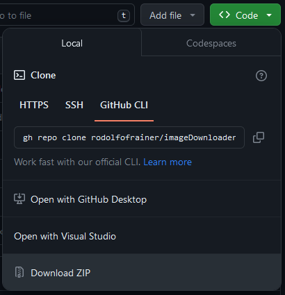
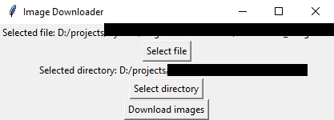

# Image Downloader
This project was created to help my wife with an ungodly amount of images needed to be downloaded, and due to her limited technological knowledge I've decided to create a GUI using tkinter.
After testing it for a bit I've decided to implement multithread to speed up the all around velocity with which the program downloads the files.

## Table of contents
- [Image Downloader](#image-downloader)
  - [Table of contents](#table-of-contents)
  - [Installation](#installation)
  - [Usage](#usage)
  - [General Information](#general-information)
  - [Example Usage](#example-usage)

## Installation
1. Click the "<> Code" button located at the top of this page, select "Download ZIP" and extract it to desired folder. 

2. Install Python download the installer [here](https://www.python.org/downloads/).

3. Check the version of python using one of these commands.
<br>```python --version``` ```python3 --version```

4. On your [IDE](https://code.visualstudio.com/Download) or terminal navegate to the folder where main.py is located. 

5.  Run the command 
<br> ```pip install -r requirements.txt```


## Usage
- To start using the program first the you need to install the required software. [*Please check this here*](#installation)

1. On your [IDE](https://code.visualstudio.com/Download) or terminal navegate to the folder where main.py is located. 
2. Run the command <br>```python main.py``` or `python3 main.py`
3. A window will open prompting you for a couple of settings, i.e. links file and destination directory
- Have the links saved on a .txt file
- Have a idea of a destination folder
<br>
4. After selecting necessary information the 'Download images' button will unlock
<br>
5. clicking the button will start the downloads at the maximum capacity your cpu and internet speed allows it.

## General Information
- The program utilizes multithreading to significantly improve download speed and overall processing efficiency.
   - [Explanation of Multithreading](#link-to-multithreading-explanation)
- **Usage of computer is not recommended** during the download process to ensure maximum speed allocation.
- If a link leads to an unavailable address, the program will attempt to ping it briefly. If the image address remains unresponsive, the program will ignore it.
- **The links should be stored in a .txt file, one link per line.**

## Example Usage
[combisteel_images.txt](combisteel_images.txt) is presented in this project so you can have an idea how the .txt file should look like.
<br>*You can use it to test the program.*